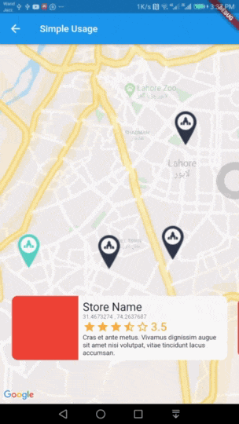

# interactive_maps_marker for Flutter
Easy to use Animated Maps Markers with detail card. Use it for store or any place locator.
## Demo


## Usage
Add this package to your `pubspec.yaml` in `dependencies:` section
```yaml
dependencies: 
  interactive_maps_marker: ^0.0.1
```
This package depends upon ```google_maps_flutter``` so first setup this by following [This Guide](https://pub.dev/packages/google_maps_flutter)

Update dependencies 
```
flutter pub get
```
You can now add a ``` InteractiveMapsMarker ``` widget to your widget tree.


### Simple Usage
In your widget import the package and use ```InteractiveMapsMarker``` Widget

**Example**
```dart
import 'package:flutter/material.dart';
import 'package:google_maps_flutter/google_maps_flutter.dart';
import 'package:interactive_maps_marker/interactive_maps_marker.dart';

class ExplorePage extends StatelessWidget {
  @override
  Widget build(BuildContext context) {

    return InteractiveMapsMarker(
      items: <MarkerItem>[
        MarkerItem(id: 1, latitude: 31.4673274, longitude: 74.2637687),
        MarkerItem(id: 2, latitude: 31.4718461, longitude: 74.3531591),
      ],
      center: LatLng(31.4906504, 74.319872),
      itemContent: (context, index) {
        return Text("Current Item $index");
      },
    );

  }
}
```

### Advanced Usage
Coming Soon

## Customise with parameters
You can customise it by passing various parameter values. Details about all parameters is as follows.

Parameter | Type | Default Value | Description
--------- | ---- | ------------- | -----------
items | ``` List<MarkerItem> ``` | none | List of Markers with type of MarkerItem. This parameter is required and cannot be null.
itemContent | ``` IndexedWidgetBuilder ``` | none | This is builder function which will receive ``` context ``` and ``` index ```. You must return a Widget which will show on a pre designed container. This is exactly like you use ListView Builder. Not applicable when using ``` itemBuilder ```
center | ``` LatLng ``` | ``` LatLng(0.0, 0.0) ``` | Center point for initial map display.
zoom | ``` double ``` | 12.0 | Default zoom value for initial map screen.
itemHeight | ``` double ``` | 116.0 | Height of your detail item. Not applicable when using ``` itemBuilder ```
itemPadding | ``` EdgeInsetsGeometry ``` | ``` EdgeInsets.only(bottom: 80.0) ``` | Padding for item detail card. Mainly used for bottom padding.
itemBuilder | ``` IndexedWidgetBuilder ``` | null | If you don't want default container and want to build the bottom widget yourself, you can use this builder instead of itemContent and have full control over UI. This is builder function which will receive ``` context ``` and ``` index ```. You must return a Widget.


## Meta

Atiq Samtia– [@AtiqSamtia](https://twitter.com/atiqsamtia) – me@atiqsamtia.com

Distributed under the MIT license.

[https://github.com/atiqsamtia/interactive_maps_marker_flutter](https://github.com/atiqsamtia/interactive_maps_marker_flutter)

## Contributing

1. Fork it (<https://github.com/atiqsamtia/interactive_maps_marker_flutter/fork>)
2. Create your feature branch (`git checkout -b feature/fooBar`)
3. Commit your changes (`git commit -am 'Add some fooBar'`)
4. Push to the branch (`git push origin feature/fooBar`)
5. Create a new Pull Request